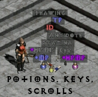

# Path of Diablo Filter

A simple filter that:
* hides potions based on level
* hides gems based on level
* hides non magical items based on level
* applies custom color to some items to improve visibility
* decorates other items with more information:
  * `eth` flag for ethereal
  * item level for charms, amulets, rings
  * tier level for maps
  * number of sockets
  * price for non magical items
  * item tier (yellow = exceptional, red = elite)

## How to use
Reference `https://raw.githubusercontent.com/gvoss/pod-item-filter/master/item.filter` in your Path of Diablo launcher

## Unique, Set, Runeword, and Socketed

## Potions, Scrolls, and Keys

